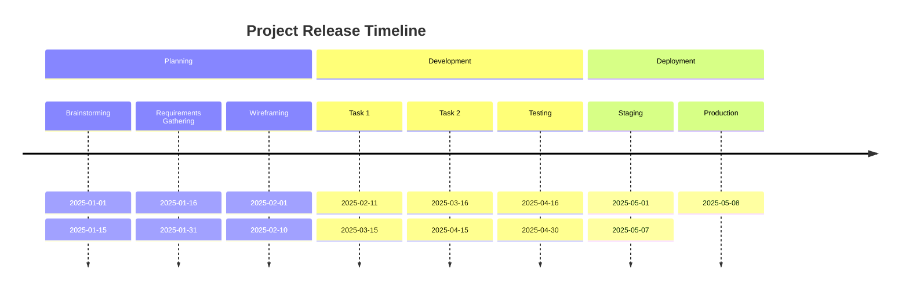

# Data Engineering

**Key Stats**

📊 150TB+| Transformed &rarr; Ingested   
🔄 500TB+| Migrated from legacy storage systems to cloud   
🎯 60TB+ | Data Aggregated  
🗜️ 50%   | Compressed from Raw data  
⚡ 50%   | Processing time reduction from Postgres  
🔍 30%   | Query time improved with new schema  


### Xceedance (Oct2021 - Present)


---
### 2. Assess assumptions on which statistical inference will be based

```javascript
if (isAwesome){
  return true
}
```

### 3. Support the selection of appropriate statistical tools and techniques


### 4. Provide a basis for further data collection through surveys or experiments

Sed ut perspiciatis unde omnis iste natus error sit voluptatem accusantium doloremque laudantium, totam rem aperiam, eaque ipsa quae ab illo inventore veritatis et quasi architecto beatae vitae dicta sunt explicabo. 


